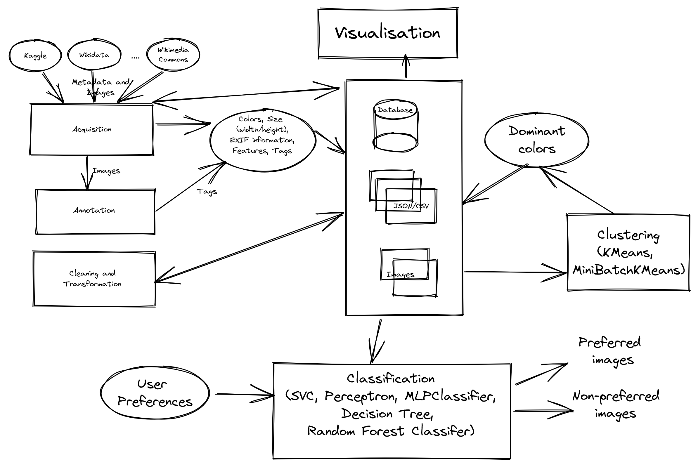

# Project_DataMining

## Table of Contents
- [Project\_DataMining](#project_datamining)
  - [Table of Contents](#table-of-contents)
  - [Project Description](#project-description)
  - [Data Collection](#data-collection)
  - [Labeling and Annotation](#labeling-and-annotation)
  - [Data Analyses](#data-analyses)
  - [Data Visualization](#data-visualization)
  - [Recommendation System](#recommendation-system)
- [Pokemon Image Classification](#pokemon-image-classification)

## Project Description
My goal is to implement a well-commented recommender system in Python and write a project report. The system should be capable of recommending images based on the user's preferences. I have three practical sessions to build this system, during which I will ensure that all tasks related to data acquisition, annotation, analysis, and visualization are automated.

The main tasks of the project are as follows:

- Data Collection
- Labeling and Annotation
- Data Analyses
- Data Visualization
- Recommendation System
- Tests
- Report

## Data Collection
For the data collection task, I will create a folder called "images" and download open-licensed images to it, with a minimum of 100 images. I will save metadata about each image, such as image size, image format (.jpeg, .png, etc.), image orientation (landscape, portrait, square, etc.), creation date, camera model, and more, in one or more JSON files. I will look for sources that provide additional information like tags, categories, and other metadata.

## Labeling and Annotation
In the labeling and annotation task, I will label and annotate images, and save additional information about each image. I may analyze the images using clustering algorithms to find predominant colors. I will try to obtain additional information like predominant colors and tags. I may ask users to tag the images with color names, #cat, #flower, #sunflower, rose, etc. I will explore automating the process of processing user tags.

## Data Analyses
For the data analyses task, I will ask users to select some images and add tags, and use that information to build a user-preference profile. I will collect information about the user's favorite colors, image orientation, image sizes, and tags, among other things. I will use different types of classifiers and clustering algorithms to obtain more information about each image.

## Data Visualization
In the data visualization task, I will visualize the different characteristics of all the downloaded images, such as the number of images available for each year, the number of images available for different types like image size, image orientation, camera models, and color characteristics. I will also add functionality to let users visualize information related to their own user profile.

## Recommendation System
For the recommendation system task, I will build the recommendation system using a collaborative filtering, content-based, or hybrid approach. I will build a user-preference profile for each user, based on the information I have collected about their favorite images. I will evaluate the limitations of my proposed approach.
# Pokemon Image Classification
1. https://www.kaggle.com/datasets/kvpratama/pokemon-images-dataset?select=pokemon_jpg
2. https://www.kaggle.com/datasets/abcsds/pokemon?resource=download
3. https://www.kaggle.com/datasets/avi1023/color-names
  
