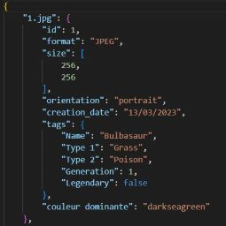

# Project Data Mining
## Authors:
- **Theotime P** - [TheoTime01](https://github.com/TheoTime01)
- **Lorenzo T** - [Lorenzo-Tuzio](https://github.com/Lorenzo-Tuzio)

## Table of Contents
- [Project Data Mining](#project-data-mining)
  - [Authors:](#authors)
  - [Table of Contents](#table-of-contents)
  - [I- Objectives of the project:](#i--objectives-of-the-project)
  - [II- Source of data, images and their license:](#ii--source-of-data-images-and-their-license)
  - [III - Data size and information stored on the images](#iii---data-size-and-information-stored-on-the-images)
  - [IV- Data mining and/or machine learning models used](#iv--data-mining-andor-machine-learning-models-used)
    - [A) Decision Tree](#a-decision-tree)
    - [B) Random Forest](#b-random-forest)
    - [C) Neural networks](#c-neural-networks)
    - [Conclusion](#conclusion)
  - [V- Self Evaluation:](#v--self-evaluation)
  - [V- Bibliography:](#v--bibliography)

## I- Objectives of the project:
The main objective of this project is to realize a recommendation system based on a user's preferences. All this project is coded in python via jupyter. We are using json format database coupled with csv file for image related information. For our recommendation system, we chose the **theme of Pokemon**. 
The user specifies if he likes or not depending on the questions he is asked, after some selections the system will recommend to the user other pokemon according to his previous choices.

## II- Source of data, images and their license:
For the source of images and data we used Kaggle a web platform that offers datasets to train in web science. It is on this platform that we got the images of pokemon as well as the complementary data like their color, type etc. The data used are under the CC0: Public Domain license. Concerning the images, they all have a size of 256x256 pixels and each one has related information in a json file. The information contained in the json file is as follows:
- The id (the number of the pokemon)
- the image format (Jpeg)
- the size of the image
- orientation (landscape or portrait)
- the date of creation of the image
- different tags containing : Type 1, Type 2, name, generation, and whether it is a legendary pokemon or not.
- The dominant color of the pokemon.

example of pokemon:

## III - Data size and information stored on the images
We have 2 sets of data :
- a 32.0 Mb image file containing 819 images
- a csv file containing information specific to each pokemon

A first program allows us to get all the metadata of each image, which are stored in a json file. Then, by comparing the name of an image and its equivalent in the CSV file, we can retrieve the name, the types, the generation of the pokemon and if it is legendary or not. 

Then, using **MiniBatchKMeans**, we can retrieve the majority color present on the image, which we then convert into hexadecimal. Finally we get the name of the color with the functions of the webcolors library.

## IV- Data mining and/or machine learning models used
### A) Decision Tree
A decision tree is a classification and regression algorithm that uses a tree approach. It is easy to interpret, can handle missing data and process both qualitative and quantitative data. It has a high performance in terms of speed and accuracy of prediction. However, it can be sensitive to input data, unstable, and have difficulty handling high-dimensional data. There is also a risk of overlearning, where the decision tree overlearns the training data and can perform poorly on new da

Here is the tree obtained with our training data: 

The metrics obtained are : 
- _Accuracy_ : 0.8142023346303502
- _F1 score_ : 0.7921653971708378

confusion matrix : 

### B) Random Forest
Random Forest is an ensemble-based machine learning algorithm that combines multiple decision trees to improve the accuracy and robustness of predictions. 
It randomly selects samples from the dataset to build decision trees, then combines their results to produce accurate and robust predictions. 
Its advantages include good accuracy, ability to handle missing data and robustness to overlearning, while its disadvantages include increased complexity and potentially inferior performance in the case of very high dimensionality data or highly correlated variables. 
We have realized 5 trees in our model.

Here are the trees obtained with our training data: 
- Tree 1 :

- Tree 2 :
  

- Tree 5 :

The obtained metrics are : 
- _Accuracy_: 0.8114355231143552
- _F1 score_: 0.8114218475952252

confusion matrix : 

### C) Neural networks

A neural network is a deep learning algorithm that is inspired by the functioning of the human brain. It consists of a large number of artificial neurons organized in layers, where each neuron is connected to neurons in a previous layer and a subsequent layer. 

Data is fed into the network by the input layer, and output is produced by the output layer. The neural network learns from the data by adjusting the weights of the connections between neurons to minimize the prediction error. 

Its advantages include a great ability to model complex relationships between inputs and outputs, as well as a great flexibility to handle different types of data. 

Its disadvantages include increased complexity, computational requirements, and increased difficulty in interpreting the learned models.

Here is the network obtained with our training data:

The resulting metrics are :

### Conclusion

Except for our neural network, our Random Forest and Decision Tree models are quite reliable because they are accurate (greater than 0.8) and are built using the most important features to identify a pokemon. However, the generated trees are very large, which means that the models may be over-fitted to the training data and would not generalize properly to the new data.
## V- Self Evaluation:

All our code is functional, we meet all the criteria of the topic and we tried to make 3 different models (Random Forest, Decision Tree and Neural Network). For our evaluation we think we have met all the objectives.

The possible improvements would be:
- to have a more complex neural network 
- to have a more accurate recognition of the dominant colors of the images
- To have a smaller Decision Tree and Random Forest to increase in precision by trying to focus only on some criteria more important than the others.

## V- Bibliography:
- **Github**:
  - https://github.com/johnsamuelwrites/DataMining

- **Data used**:
  - https://www.kaggle.com/datasets/kvpratamapokemon-images-dataset?select=pokemon_jpg
  - https://www.kaggle.com/datasets/abcsds/pokemon?resource=download

- **Others**:
  - https://stackoverflow.com/questions/75140979/valueerror-invalid-literal-for-int-with-base-10-using-ann-visualizer
  - https://datascience.stackexchange.com/questions/12851/how-do-you-visualize-neural-network-architectures
  - https://stackoverflow.com/questions/75140979/valueerror-invalid-literal-for-int-with-base-10-using-ann-visualizer
  - https://stackoverflow.com/questions/61192374/interpreting-k-means-cluster-centers-output